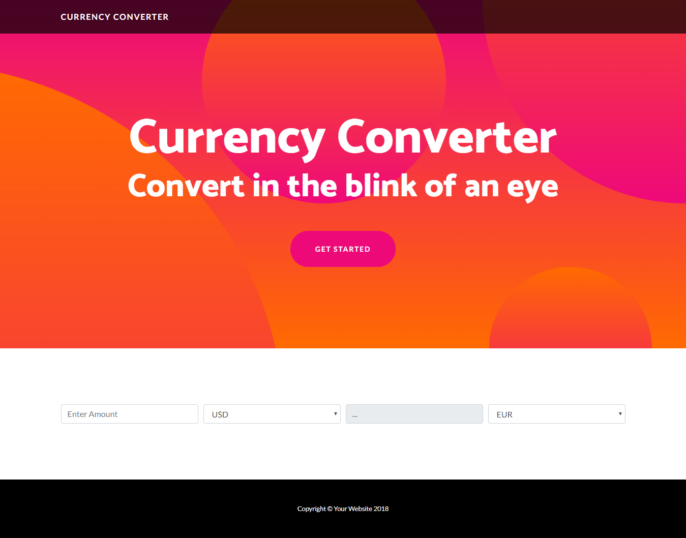

# Currency Converter

7 days challenge by ALC

This currency converter was designed for both mobile and desktop use. It uses service worker to give an online first experience. Its use is pretty straightforward and it's visible [here](https://z3u2.github.io/Currency-Converter/) .

I used a template by blackrockdigital found on startbootstrap under an MIT license.

#

For dev purposes, I set up a gulpfile with browsersync and automatic compilation of sass

run `gulp dev` for dev server
and `gulp serve` if you wanna try the app without browsersync etc..
